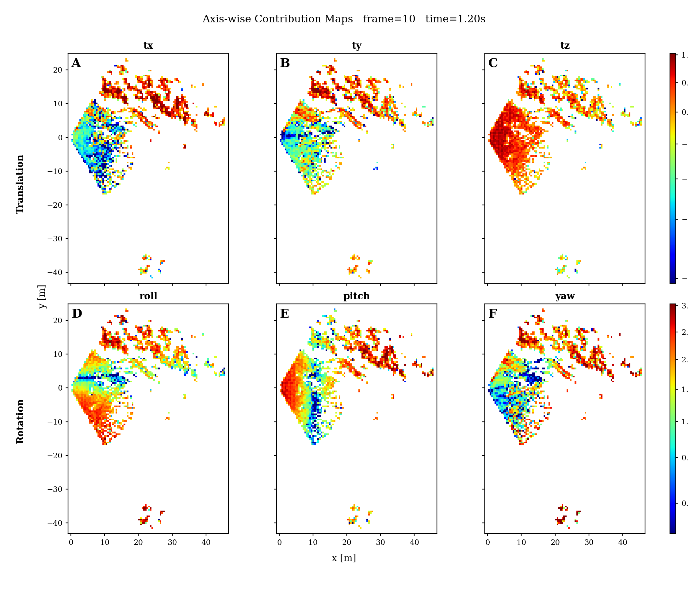
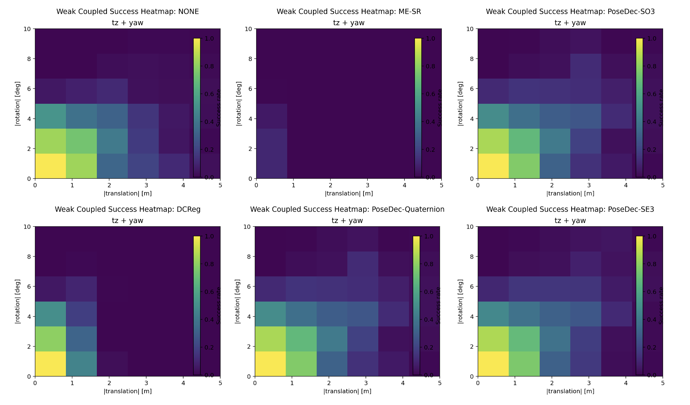

# PoseDec: Analytic Pose Decoupling in SLAM

**PoseDec** introduces a unified theoretical framework for analytic pose decoupling in Simultaneous Localization and Mapping (SLAM). It formulates environmental information geometric constraints that are entirely **sensor-agnostic** and universally applicable to **any pose parameterization method**.

By abstracting the geometric constraints from the sensor hardware and the specific mathematical representation of the pose, PoseDec offers a robust mathematical foundation that easily plugs into a wide variety of downstream SLAM and computer vision tasks. We can take our previous work [DCReg](https://github.com/JokerJohn/DCReg) as just an application for ICP in degenerate environment. **In this work, we aim to generalize this analytical approach to any scenario where geometric constraints can be explicitly modeled**.

## Key Features

* **Sensor-Agnostic:** Operates independently of the specific sensor modality (e.g., LiDAR, Camera, Radar, IMU).
* **Universal Parameterization:** Fully compatible with any state/pose parameterization method (e.g., Quaternions, Euler angles, Lie algebra $SE(3)$).
* **Analytic Rigor:** Provides a strict, mathematically grounded theoretical framework for analyzing environmental geometric constraints.

## Applications
The PoseDec framework can be seamlessly integrated into various front-end and back-end modules, including but not limited to:
* **Odometry:** Enhancing state estimation accuracy across sequential frames.
* **Loop Closure Detection:** Improving the robustness of place recognition.
* **Point Cloud Registration:** Accelerating and stabilizing point-to-point, point-to-plane, or distribution-based matching.
* **Visual Odometry (VO) Initialization:** Providing reliable initial states for monocular or stereo setups.
* **Perspective-n-Point (PnP):** Optimizing camera pose estimation from 3D-2D correspondences.
* **Extrinsic Calibration:** Enabling high-precision spatial synchronization between multi-sensor suites.
* **Radar SLAM**

## Getting Started
### Prerequisites
* Ubuntu 20.04 (Recommended)
* C++14 or higher
* Eigen

### Build
```bash
mkdir -p workspace/src && cd workspace/src
git clone https://github.com/JokerJohn/PoseDec
cd ..
catkin_make # or catkin build / colcon build
```

## Examples

### Point-level Observability analysis



### ICP Robustness vs different perturbation of initial pose


